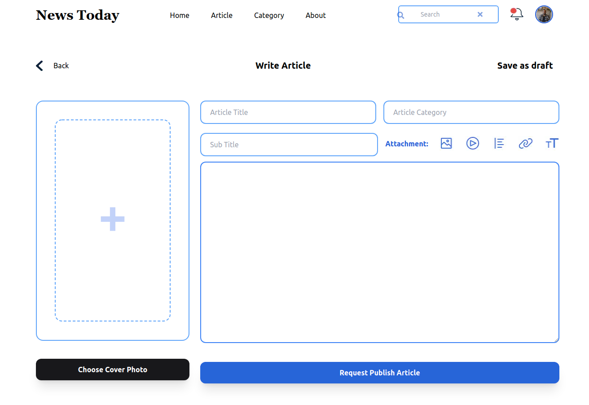
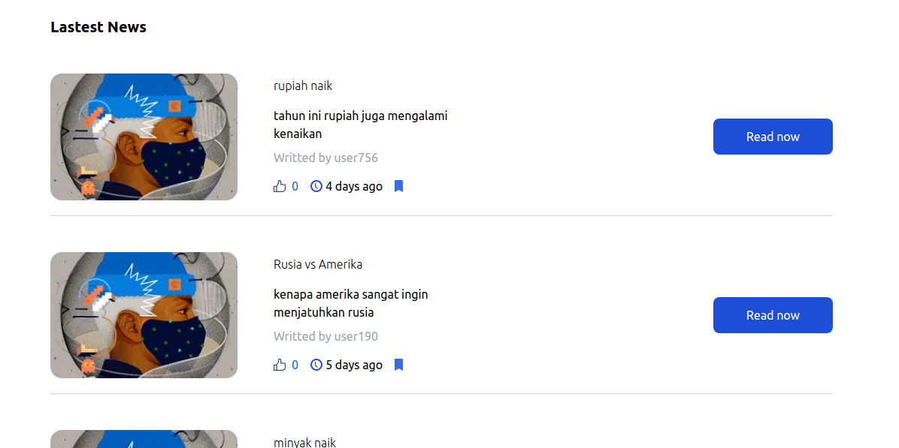

# News Today

**News Today** adalah platform tempat berbagi berita, jadi saat kalian punya keinginan membagi informasi (yang umumnya berupa tulisan) kalian bisa menggunakan News Today


## Built With

- [React.js]
- [Next.js]
- [Mysql]
- [Express.js]


## Installation

1. Clone the repo
   ```sh
   git clone https://github.com/Rayxzzz/news.git
   ```
2. Install NPM packages
   ```sh
   npm install
   ```
3. Start the Application
   ```sh
   npm run dev
   ```

## Demonstration

Demo : https://bit.ly/newsToday

email : q@gmail.com || password : 123


## Snippets

Here are some snippets about this app:

- Home


- Login


- Post Article




- Last News




